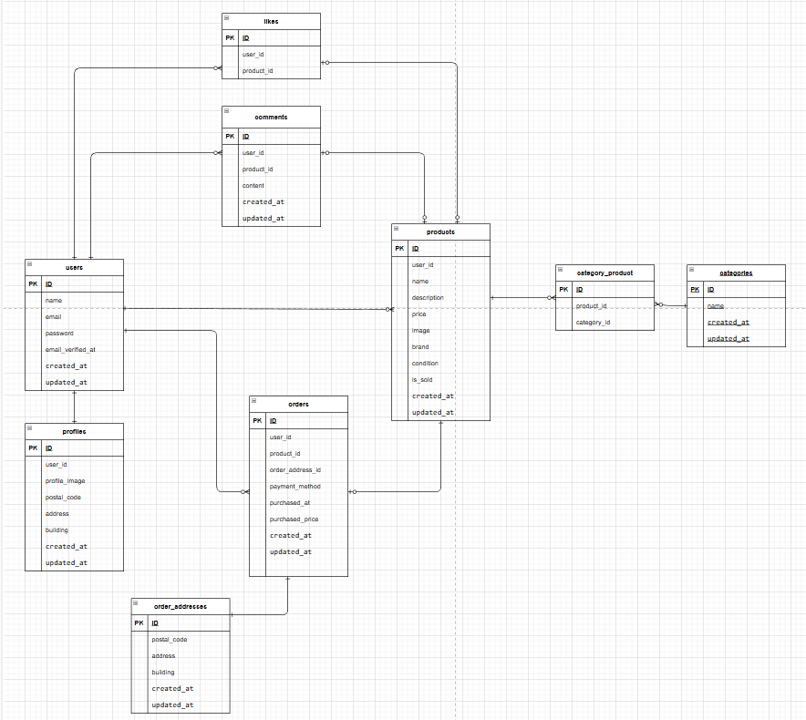

# FleaMarket

# 環境構築

## Docker

git clone https://github.com/Naruyama628/FleaMarket.git  
cd FleaMarket

cp src/.env.example src/.env

.envのDB設定を反映させる  
.envに下記をペースト

・STRIPE_KEY=pk_test_xxxxx  
・STRIPE_SECRET=sk_test_xxxxx  
・STRIPE_WEBHOOK_SECRET=

docker-compose up -d --build

###Laravel  
docker-compose exec php bash  
composer install  
cp .env.example .env  
php artisan key:generate  
php artisan migrate  
php artisan db:seed  
php artisan storage:link

.env にWebhook Secret反映

# 使用技術

PHP 8.2.11

Laravel 8.83

MySQL 8.0.26

nginx 1.21.1

phpMyAdmin

Docker / Docker Compose

# ER図

# URL

商品一覧画面: http://localhost/

ユーザー登録: http://localhost/register

phpMyAdmin: http://localhost:8080
